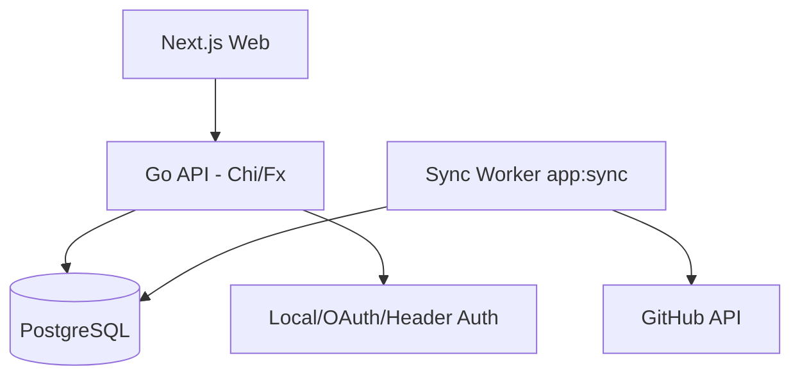
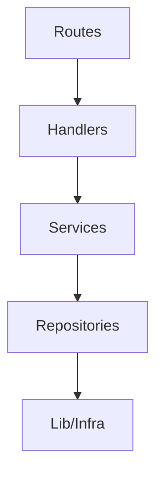
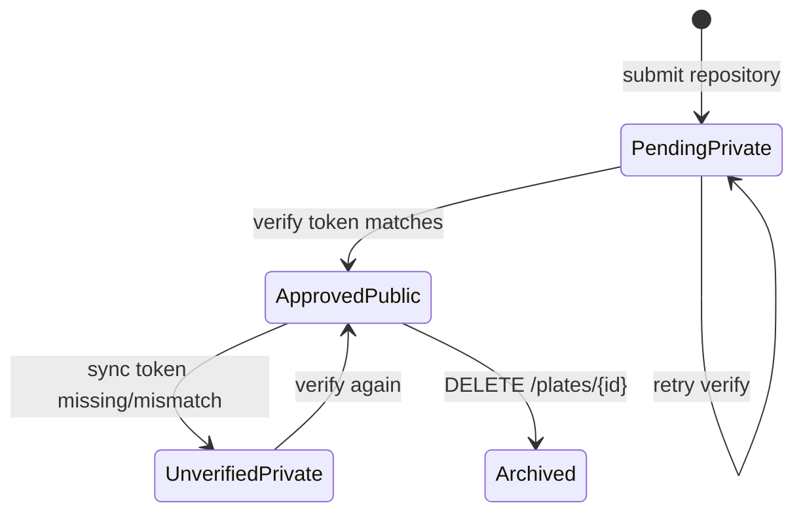
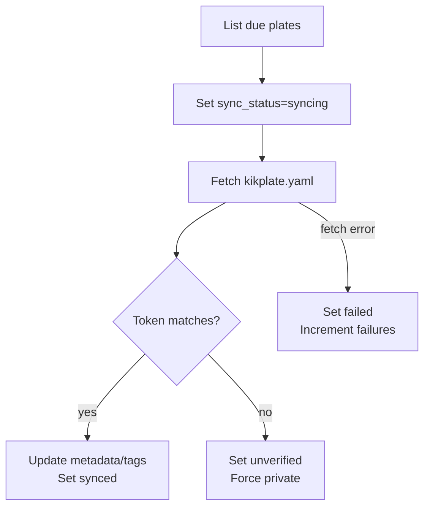

# Kickplate Architecture

## Overview
Kickplate is a Go API plus Next.js web app for discovering and publishing repository-backed templates ("plates").

- Backend: Go, Chi, Uber Fx, GORM, PostgreSQL
- Frontend: Next.js
- Auth: local email/password, OAuth providers, or trusted header auth
- Sync: background worker that re-fetches `kikplate.yaml` from GitHub

## Runtime Commands
The API exposes Cobra commands wired through Fx:

- `app:serve`: start HTTP API server
- `app:sync`: start background sync worker
- `db:seed`: seed data

Sync is configured from `config.yaml` / env with:

- `sync.interval` (default `6h`)
- `sync.poll_interval` (default `30s`)
- `sync.batch_size` (default `25`)

## Layering
Dependencies flow downward:

1. Routes (`api/handler/routes`)
2. Handlers (`api/handler/handlers`)
3. Services (`api/service/*`)
4. Repositories (`api/repository`)
5. Infrastructure (`api/lib`)

Fx modules assemble the app in:

- `api/lib/module.go`
- `api/repository/postgres/module.go`
- `api/service/module.go`
- `api/handler/handlers/module.go`
- `api/handler/routes/module.go`

## HTTP Surface
Current routes are registered by `api/handler/routes/module.go`.

### Health/Test
- `GET /hello`

### Auth
- `POST /auth/register`
- `GET /auth/verify-email?token=...`
- `POST /auth/login`
- `GET /auth/{provider}/redirect`
- `GET /auth/{provider}/callback`
- `GET /auth/providers`
- `GET /me` (auth required)
- `PATCH /me/profile` (auth required)
- `PATCH /me/username` (auth required)

### Plates
- `GET /plates`
- `GET /plates/stats`
- `GET /plates/filters`
- `GET /plates/bookmarked` (auth required)
- `POST /plates/repository` (auth required)
- `GET /plates/{slug}`
- `PATCH /plates/{id}` (auth required)
- `POST /plates/{id}/verify` (auth required)
- `PUT /plates/{id}/organization` (auth required)
- `DELETE /plates/{id}` (archive, auth required)
- `DELETE /plates/{id}/remove` (hard delete, auth required)
- `POST /plates/{id}/bookmark` (auth required)
- `POST /plates/{id}/reviews` (auth required)
- `PUT /plates/{id}/tags` (auth required)
- `POST /plates/{id}/approve` (auth required)
- `POST /plates/{id}/reject` (auth required)
- `POST /plates/{id}/badges` (auth required)
- `DELETE /plates/{id}/badges/{slug}` (auth required)

### Organizations
- `GET /organizations`
- `POST /organizations` (auth required)
- `GET /organizations/me` (auth required)
- `GET /organizations/by-name/{name}`
- `GET /organizations/{id}`
- `PUT /organizations/{id}` (auth required)
- `DELETE /organizations/{id}` (auth required)

### Badges
- `GET /badges`

## Plate Lifecycle
Kickplate is repository-first. Plate type is currently only `repository`.

1. User submits repository via `POST /plates/repository`.
2. Service fetches `kikplate.yaml` from the submitted repo and branch.
3. Owner validation:
- Personal submission: `kikplate.yaml.owner` must match username.
- Organization submission: `kikplate.yaml.owner` must match org name.
4. Plate is created as pending + private with generated `verification_token`.
5. User adds that token to `kikplate.yaml` and calls `POST /plates/{id}/verify`.
6. On success: plate becomes approved, public, verified, and sync schedule is initialized.

## Synchronizer
`app:sync` loops on `sync.poll_interval` and processes due repository plates.

For each due plate:

1. Mark `sync_status=syncing`.
2. Fetch `kikplate.yaml` from GitHub API.
3. Validate verification token still matches.
4. If valid, update metadata + tags and mark synced.
5. If invalid/missing token, mark unverified and force private visibility.
6. On failures, increment `consecutive_failures`, save `sync_error`, and schedule next retry.

## Auth and Identity
Middleware chain in `app:serve`:

1. JWT bearer authentication (`Authenticate`)
2. Optional header-based auth (`HeaderAuth`)

Both resolve to an `account_id` in request context. Protected handlers check it explicitly and return `401` when missing.

## Search and Filtering
Plate listing supports:

- Text search (`search`) over weighted full-text + trigram fallback (`name`, `description`, `tags`)
- Multi-category filters (`categories` or `category`)
- Multi-type filters (`types` or `type`)
- Multi-tag filters (`tags` or `tag`)
- Owner filter (`owner_id`)
- Pagination (`page`, `limit`)

Repository adds indexes for full-text, trigram, and common sort/filter paths.
