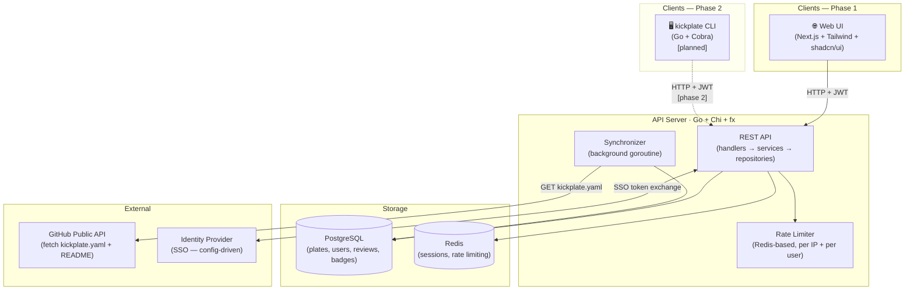
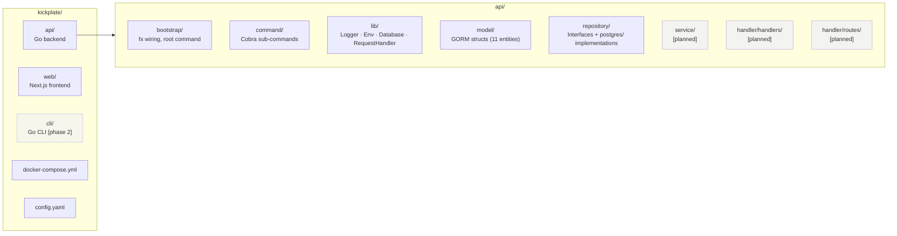
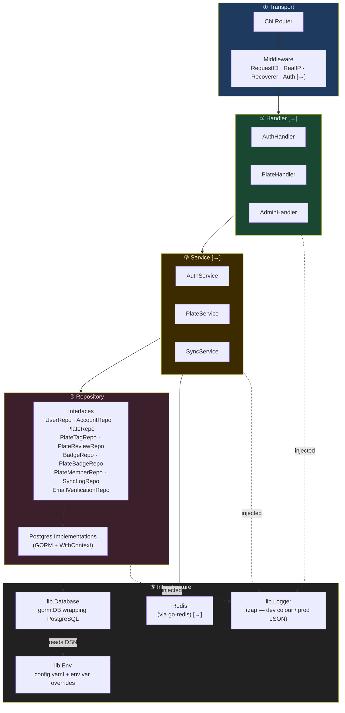
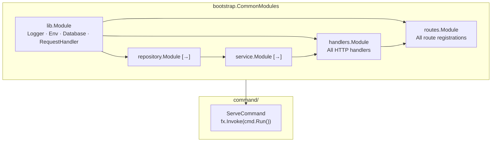
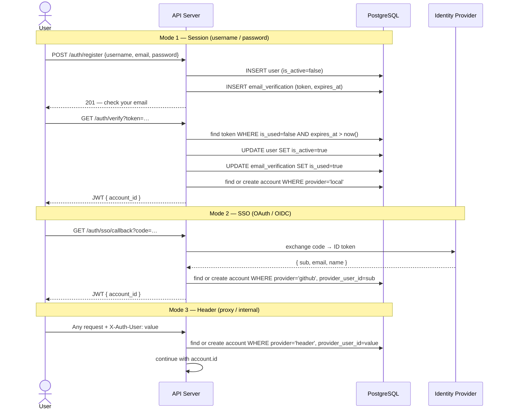
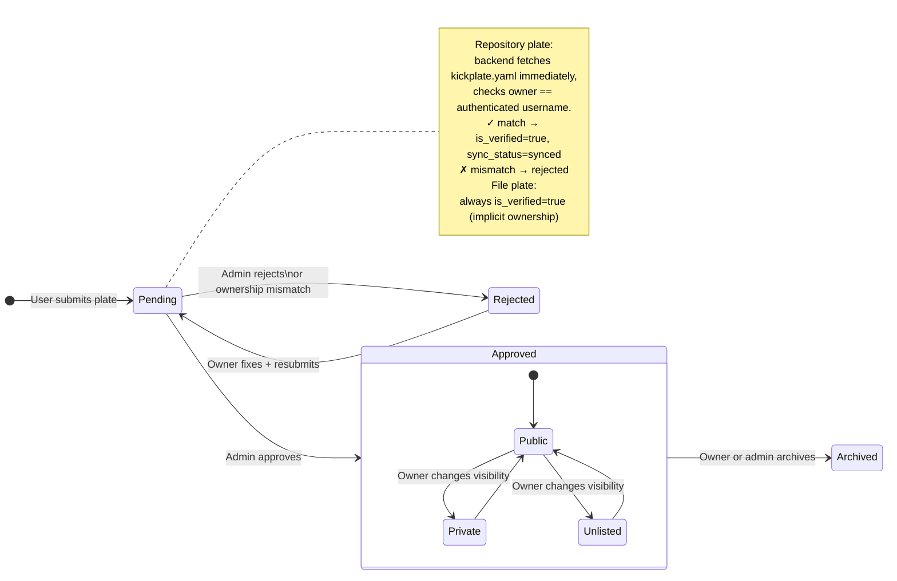
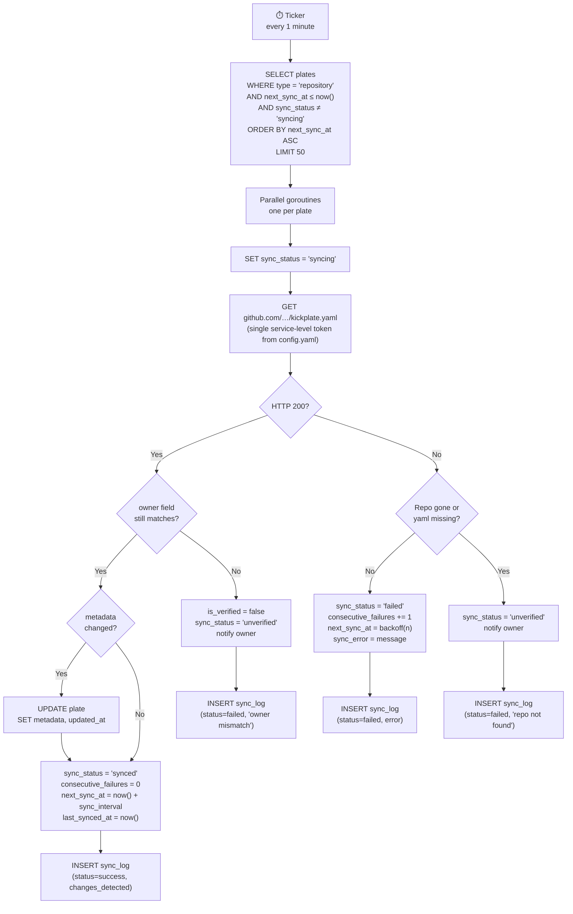
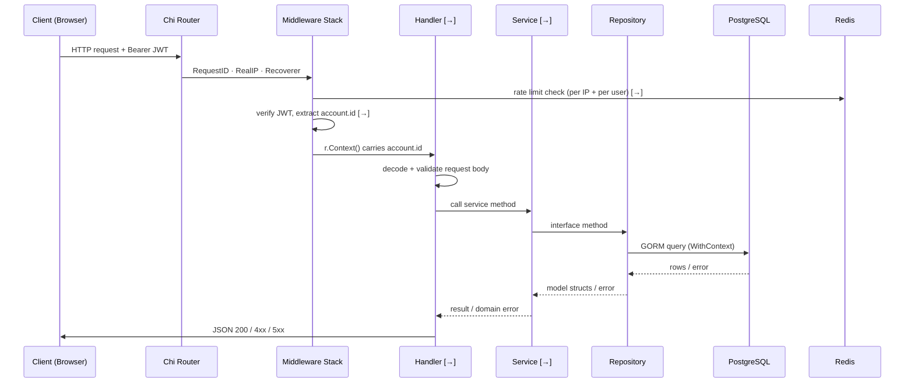
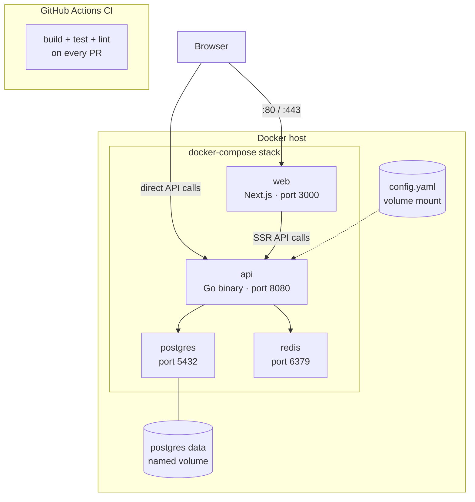
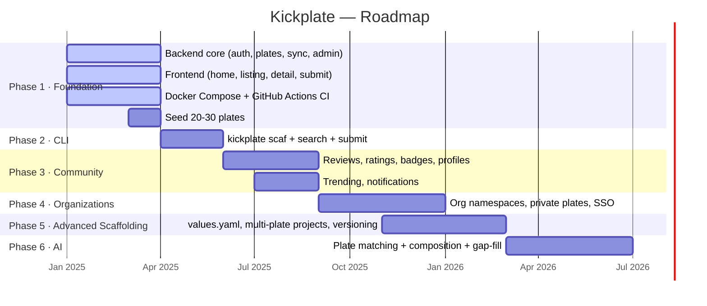

# Kickplate — Architecture

> **Living document.** Grows incrementally alongside the codebase. Each section is added as the system evolves.
> Database design is covered separately in `database.md`.

---

## Table of Contents

1. [System Overview](#system-overview)
2. [Repository Structure](#repository-structure)
3. [Backend Layer Architecture](#backend-layer-architecture)
4. [Dependency Injection — fx Wiring](#dependency-injection--fx-wiring)
5. [Auth Flow](#auth-flow)
6. [Plate Lifecycle](#plate-lifecycle)
7. [Synchronizer Design](#synchronizer-design)
8. [Request Lifecycle](#request-lifecycle)
9. [Deployment Topology](#deployment-topology)
10. [Roadmap Phases](#roadmap-phases)

---

## System Overview

Kickplate is an open-source template registry — a community-driven marketplace where developers discover, share, and scaffold production-ready project templates via a web UI or CLI. Think *npm for project templates*.



---

## Repository Structure



---

## Backend Layer Architecture

Dependencies flow **downward only**. No layer imports from a layer above it. Uber fx enforces this at wire-up time.



> `[→]` = planned, not yet implemented.

---

## Dependency Injection — fx Wiring

All modules are composed in `bootstrap/modules.go` and injected by Uber fx at startup.



---

## Auth Flow

Three auth modes all resolve to a single `account.id` used by every downstream table. The mode is selected by `config.yaml` — no code change needed to switch modes.



---

## Plate Lifecycle



---

## Synchronizer Design

Runs as a background goroutine on a 1-minute ticker. Only acts on repository plates — file plates have no remote source to sync.



**Backoff schedule**

| Consecutive failures | Next retry delay |
|---|---|
| 1 | 30 minutes |
| 2 | 2 hours |
| 3 | 12 hours |
| 4+ | 24 hours + owner notification |

---

## Request Lifecycle

A typical authenticated API request from ingress to storage and back.



---

## Deployment Topology

Self-hosting is a first-class requirement. Target experience: `docker-compose up` and done.



```bash
git clone https://github.com/kickplate/kickplate
cd kickplate
cp config.example.yaml config.yaml   # fill in secrets
docker-compose up
# → running at http://localhost:8080
```

---

## Roadmap Phases



---

*Last updated: initial draft — system overview, repo structure, layers, fx wiring, auth, plate lifecycle, synchronizer, request lifecycle, deployment, roadmap.*